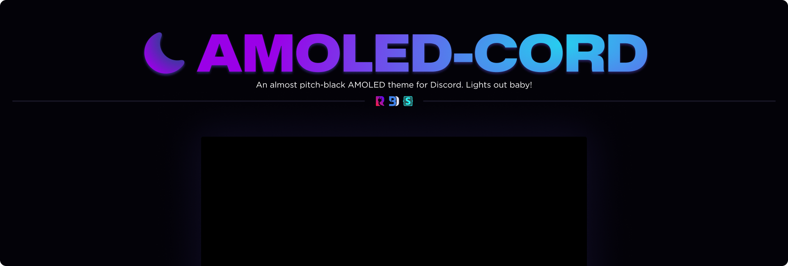

---
###  **[Replugged](https://replugged.dev)**
- [Direct Install]()

###  **[BetterDiscord](https://betterdiscord.app)**
- [Direct Download]()
- [Compiled Source]()

###  **Stylus**
> **Warning**  
> Firefox users must have "Patch CSP to allow style assets" enabled for the theme to work. This can be found in Stylus' settings under "Advanced"
1. Install the broswer extensions for your repsective browser.
    - [Chrome Webstore](https://chrome.google.com/webstore/detail/stylus/clngdbkpkpeebahjckkjfobafhncgmne)
    - [Firefox Addons](https://addons.mozilla.org/en-US/firefox/addon/styl-us)
2. Once installed, open [this link]() in a new browser tab. This opens the page where you will install this userstyle.
3. Press the `Install Style` button.

### **[Vencord](https://github.com/Vendicated/Vencord)**
1. ill add steps in the future oK??
---
### Licensing
This theme is licensed under the MIT license. Please refer to the [LICENSE](./LICENSE) file for more details regarding rigths and limitations.
